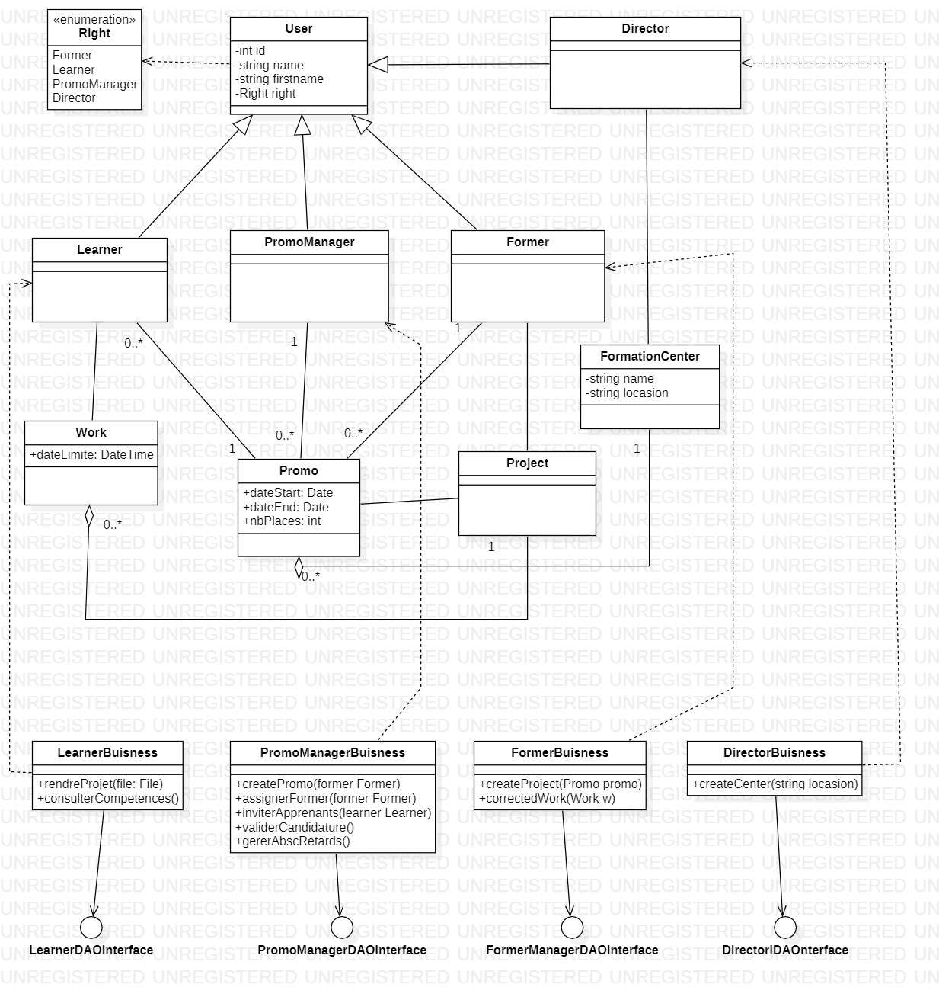

# Reseau Centres de Formation

Contexte
Un réseau de centre de formation (qu'on ne nommera pas) souhaite créer une plateforme unifié pour regrouper
les différentes tâches courantes propres à chaque centre.
Les besoins sont les suivants :

Les directeurices de régions doivent pouvoir gérer les différents centres de formation
Les chargé·e·s de promos doivent pouvoir gérer les promotions du ou des centre(s) auxquels ielles sont rattaché·e·s

Créer des nouvelles promotions //Mattias
Inviter des apprenant·e·s dans les promos
Valider une candidature
Assigner un·e formateur·ice à une promotion
Gérer les retards et absences des apprenant·e·s

Les formateur·ice·s doivent pouvoir créer des projets //Nesrses // puis les assigner à leurs promos ainsi que les corriger
On doit être capable de consulter l'agenda des formations en cours ou à venir
On doit pouvoir candidater à une formation à venir
Un·e apprenant·e doit avoir accès aux projets proposés à sa promotion ainsi que proposer un rendu //Najat//. Ielle doit également pouvoir consulter son avancement dans les compétences

Les promos sont liées à un référentiel (DWWM, CDA, TAI...) qui détermine les compétences et les projets assignables à cette promotion. Il est probable que d'autres référentiels soient rajoutés par la suite.
D'autres fonctionnalités peuvent être envisagées : Gestion des livrets d'évaluation, dossier professionnels et dossier projets via la plateforme. Gestion de l'agenda des promotions.

Objectifs
En groupe de 3-4, vous devrez créer une ébauche de spécifications fonctionnelles et techniques pour ce projet.
Il faudra créer les différents diagramme UML (use case, activité, classes, séquence, état-transition), faire quelques maquettes fonctionnelles.
Vous pourrez ensuite définir les sprints et les tâches (via gitlab) ainsi que définir le poids de celles ci via un planning poker.

## Use Case

### Diagramme de Use Case

[Exemple du use case écrit : Deposer un projet](UseCaseEcritDeposerProjet.odt)

## Activité

### Diagramme d'activité

## Classes

### Diagramme de classe initial

### Diagramme de classe réalisé en groupe

## Séquence

### Diagramme de séquence 

